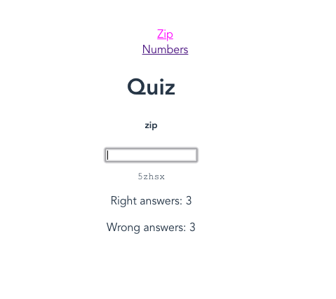

# ielts-numbers

Simple project on Vue.js to help you with IELTS listening section (only numbers & zip codes). [Try it online](https://ielts-listening.netlify.com/)

* press the Start button
* listen to the synthesized voice
* type right answer into the text box and press enter
* repeat

